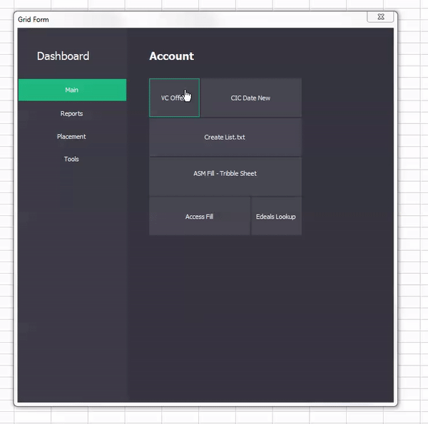

# VBA Modern Userform

A Userform that is designed to look and work like windows 10 Tiles menu. 

  

@alexofrhodes  
Modified to take GridBox data from a table in worksheet.  
Moved sizes and colors to MainTheme, add your own.  
  
I have not bothered with the NewGridBox.  
  
I strongly recommend to look at Robert Todar's Userform EventListener and other projects  